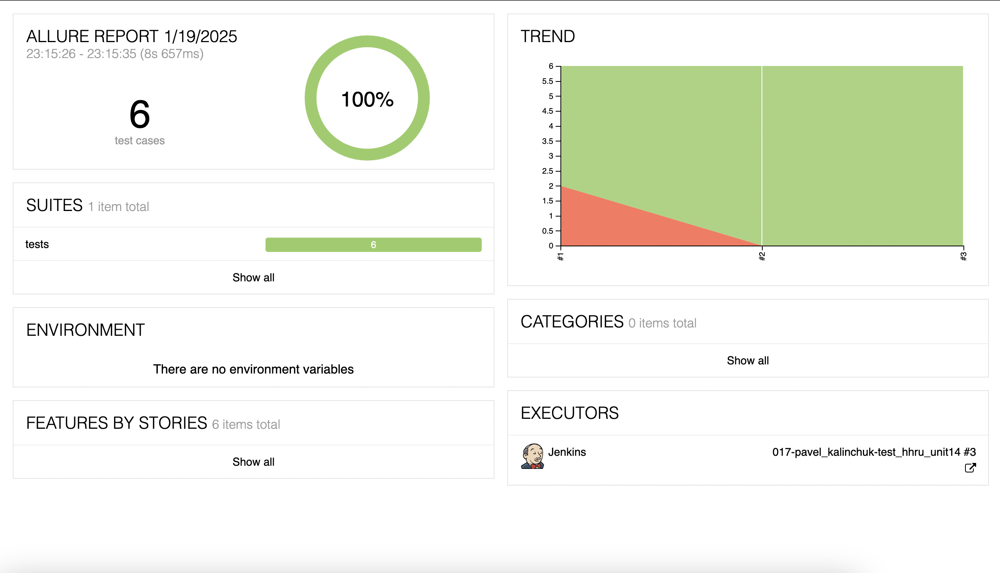
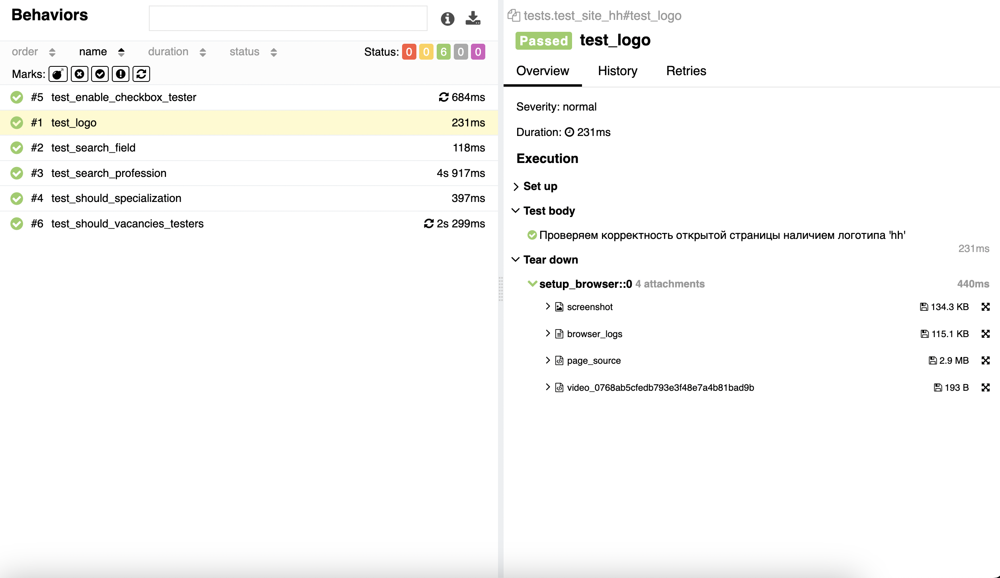
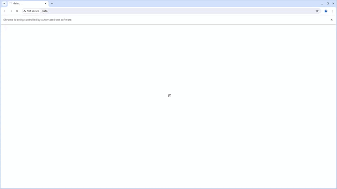
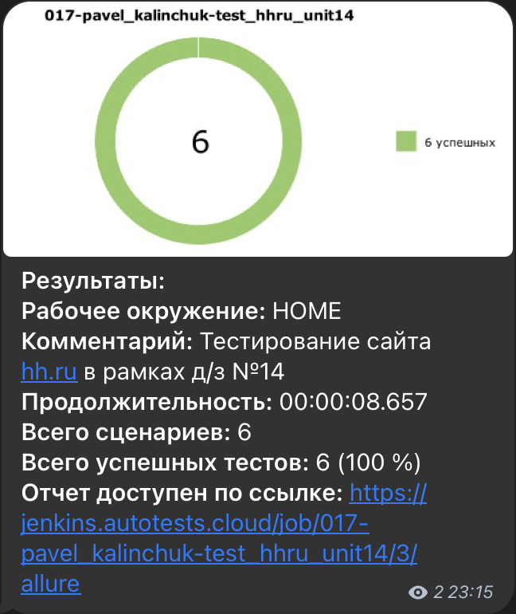
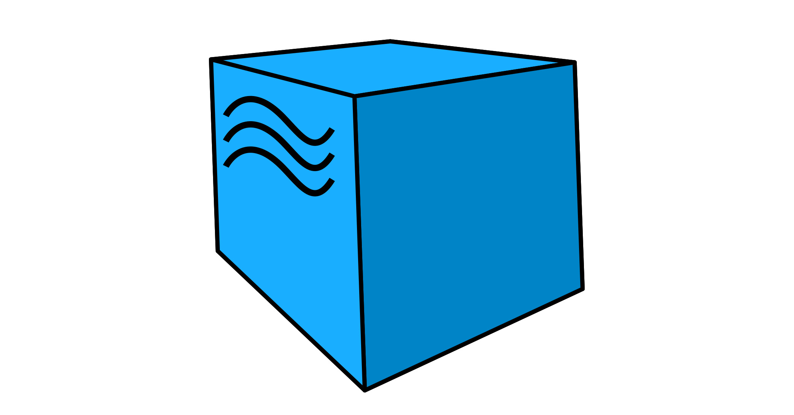

# Проект "hh.ru"
___

## Заметки к проекту
На текущий момент реализовано:
- Открываем главную страницу сайта hh.ru
- Находим поле поиска необходимой професси
- Вводим в поле поиска профессию "Тестировщик"
- На странице с результатами поиска находим фильтр по специализации "Тестировщик"
- Выбираем специализацию "Тестировщик"
- Проверяем количество вакансий по специализации "Тестировщик"

___ 
### Примечание:
*Проект проверен на локальных запусках и с помощью популярного сервера автоматизации Jenkins*
___

### Локальный запуск тестов

#### Запуск:
1. В терминале перейти в каталог с тестом *'/tests'*
2. Используя команду `pytest test_site_hh.py` выполнить запус тестов
#### Фомирование отчёта:
1. По завершению работы тестов находясь в том же каталоге, выполнить команду `allure generate`. В результате будет создан каталог 'allure-report' с данными отчёта
2. Далее запустить команду `allure open allure-report`. В результате будет открыта вэб-страница с allure-отчётом

> *Примечание!* 
> 
> *Если отчёт не открывается при выполнении команды описанной выше, то можно попробовать открыть отчёт командой:* 
> 
>`allure open -h localhost -p 8081`
> 
>*Данная проблема может встретится на ПК под управлением MacOS!*
___

### Запуск тестов в Jenkins

#### Запуск:
1. Откройте сраницу [проекта](https://jenkins.autotests.cloud/job/017-pavel_kalinchuk-test_hhru_unit14/)
2. В левом меню выберите пункт "Build now"
3. Дождитесь завершения работы тестов
5. После сборки, результат работы можно увидеть в ``Allure Report``

#### Просмотр отчёта:
1. В области "Build" *(левая нижняя часть экран)* кликните на пиктограмме *allure*
2. Дождитесь откытия страницы отчёта

## Примеры отчётов

### В Allure

#### Общий

#### Детальный

#### Видеопрохождение теста

### В Telegram

---
### В разработке тестов использовался следующий стек:  

 

 

[2]: https://upload.wikimedia.org/wikipedia/commons/c/c9/Finder_Icon_macOS_Big_Sur.pngx